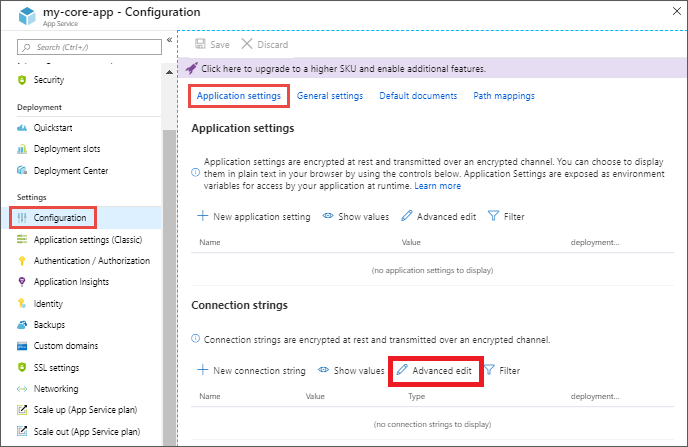

# dotnet-appsettings - .NET tools

A tool to convert appsettings.json files to json name-value format support bulk update to Application Settings on Azure AppService.

- appsettings.json

```json
{
  "Logging": {
    "LogLevel": {
      "Default": "Information",
      "Microsoft": "Warning",
      "Microsoft.Hosting.Lifetime": "Information"
    }
  },
  "AllowedHosts": "*"
}
```

- Azure AppService / Configuration / Application Settings / Advanced edit (https://docs.microsoft.com/en-us/azure/app-service/configure-common#edit-in-bulk)



```json
[
  {
    "name": "Logging__LogLevel__Default",
    "value": "Information",
    "slotSetting": false
  },
  {
    "name": "Logging__LogLevel__Microsoft",
    "value": "Warning",
    "slotSetting": false
  },
  {
    "name": "Logging__LogLevel__Microsoft.Hosting.Lifetime",
    "value": "Information",
    "slotSetting": false
  },
  {
    "name": "AllowedHosts",
    "value": "*",
    "slotSetting": false
  }
]
```

## Getting started

### Installation dotnet tool globally

Download and install the .NET Core 5 SDK. Once installed, run the following command:

```
dotnet tool install --global dotnet-appsettings
```

If you already have a previous version of dotnet-appsettings installed, you can upgrade to the latest version using the following command:

```
dotnet tool update --global dotnet-appsettings
```

Usage

```
appsettings appsettings.json appsettings.Production.json
```

### Installation dotnet tool locally

You can either install the tool locally in the project folder scope as https://docs.microsoft.com/en-us/dotnet/core/tools/local-tools-how-to-use

```
cd /d C:\Development\Project1
dotnet new tool-manifest
dotnet tool install dotnet-appsettings
```

Usage

```
C:\Development\Project1\Core> dotnet appsettings appsettings.json appsettings.Production.json
```

### Usage

```
Command line global:
  appsettings [appsettings.json [appsettings.Production.json]]

Command line local:
  dotnet appsettings [appsettings.json [appsettings.Production.json]]

Parameters:
  -p|--path     path to appsettings.json, appsettings.Production.json
```
